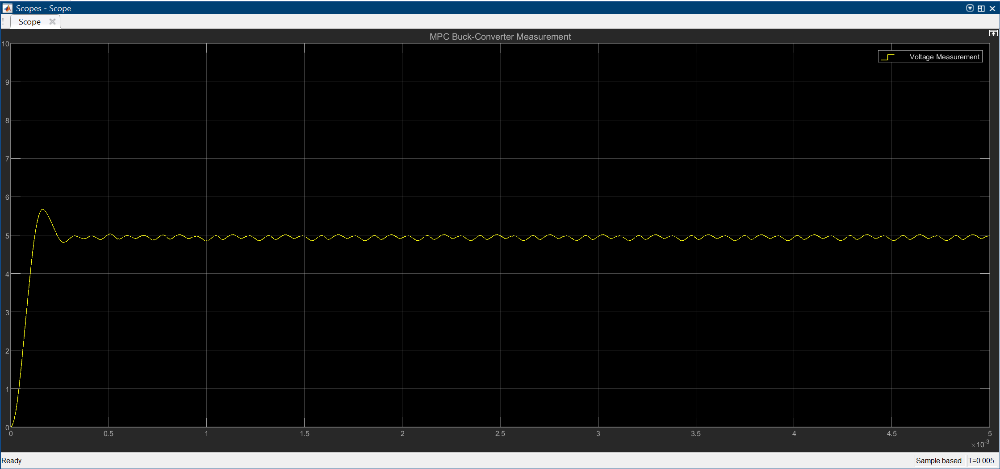
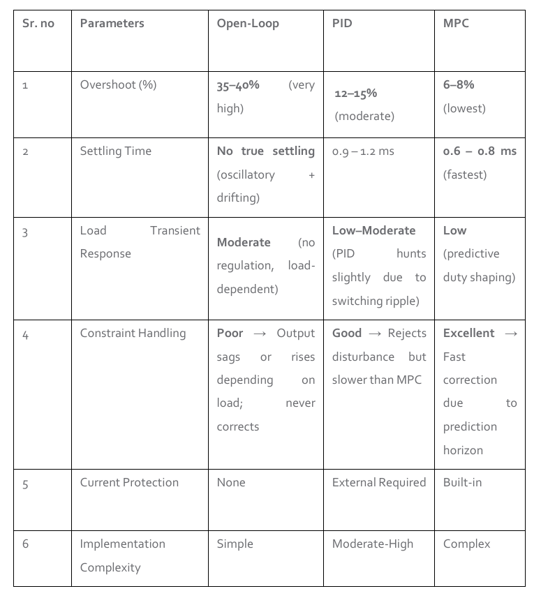

# Model Predictive Control of a DC–DC Buck Converter

This project implements and compares PID and Model Predictive Control (MPC) for a 12 V → 5 V DC–DC buck converter.  
The converter is validated in LTspice and modeled in MATLAB/Simulink using an averaged state-space approach.

## Overview

Modern power converters require fast and accurate control to ensure stable voltage regulation under load variations.  
This project demonstrates how Model Predictive Control (MPC) outperforms a classical PID controller by:

- Reducing overshoot  
- Improving settling time  
- Handling constraints  
- Providing better disturbance rejection  

Simulations were performed in **LTspice**, **MATLAB**, and **Simulink**.

## Specifications

| Parameter | Value |
|----------|--------|
| Input Voltage | 12 V |
| Output Voltage | 5 V |
| Inductor | 100 µH |
| Capacitor | 47 µF |
| Load | 2.5 Ω |
| Switching Frequency | 100 kHz |

## Methodology

1. Designed a buck converter in **LTspice** and verified switching, transient, and steady-state behavior.  
2. Derived continuous-time and discretized **state-space models** for control design.  
3. Implemented an averaged plant model in **Simulink** and validated it against LTspice results.  
4. Built two closed-loop control systems:  
   - Classical **PID controller**  
   - **Model Predictive Controller (MPC)** with duty-cycle constraints  

## 🎛 Controller Designs

### PID Controller
- Tuned using step-response shaping  
- Served as baseline  
- Characteristics:  
  - Overshoot: **12–15%**  
  - Settling Time: **0.9–1.2 ms**  
  - Disturbance performance: moderate  

### Model Predictive Controller (MPC)
- Designed using prediction horizon and constrained optimization  
- Characteristics:  
  - Overshoot: **6–8%**  
  - Settling Time: **0.6–0.8 ms**  
  - Excellent disturbance rejection  
  - Built-in constraint handling  

## Results

### Step Response Comparison

PID vs MPC performance clearly shows:
- **Lower overshoot** with MPC  
- **Faster settling**  
- **Less oscillation**  
- **Better load-step handling**  

#### PID Output  

#### MPC Output  

#### Performance Table  

## Repository Structure

## ▶️ How to Run the Simulation

1. Install MATLAB R2021a or later.
2. Ensure the following toolboxes are installed:
   - Simulink  
   - Simscape / Simscape Electrical  
   - Model Predictive Control Toolbox
3. Open the models in the `/simulink/` folder:
   - `mpc_buck.slx`
4. Run the simulations using the Run button in Simulink.
5. The MATLAB scripts in the `/matlab/` folder can be used to:
   - Initialize plant parameters  
   - Configure MPC settings  
6. LTspice files in `/ltspice/` can be opened using LTspice to view the original switching-level model.

